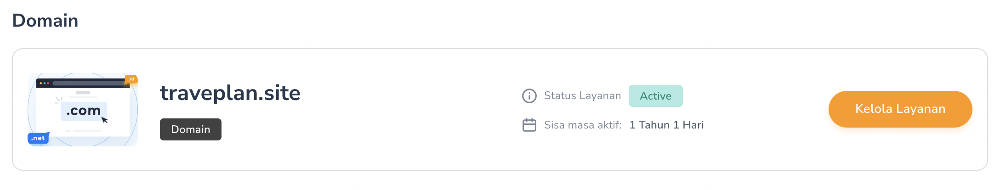
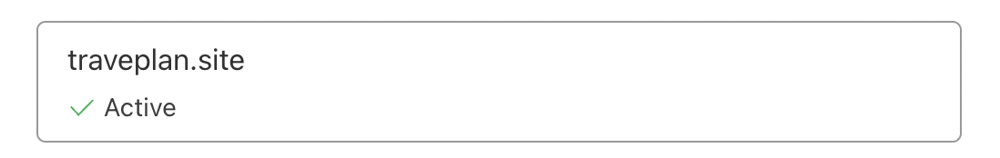
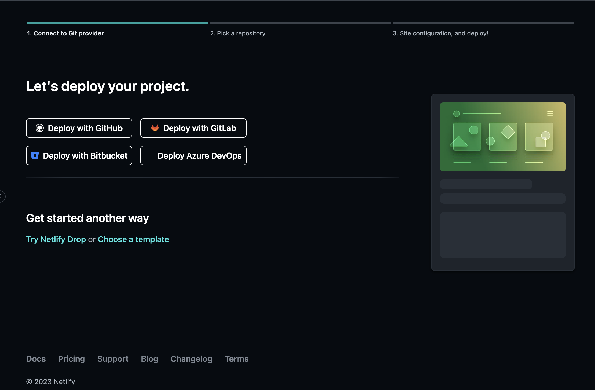
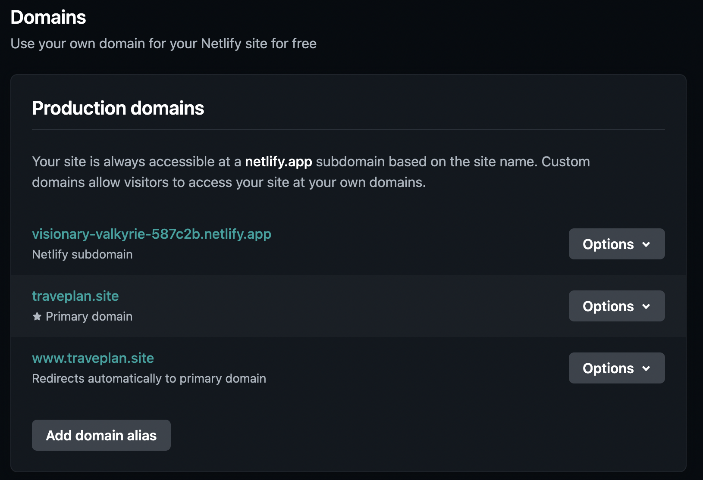
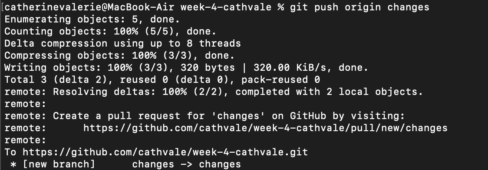
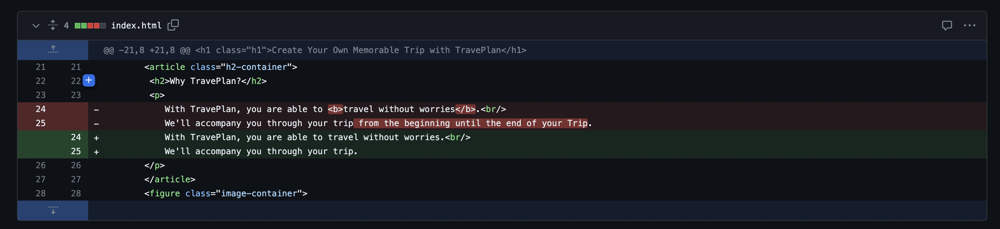
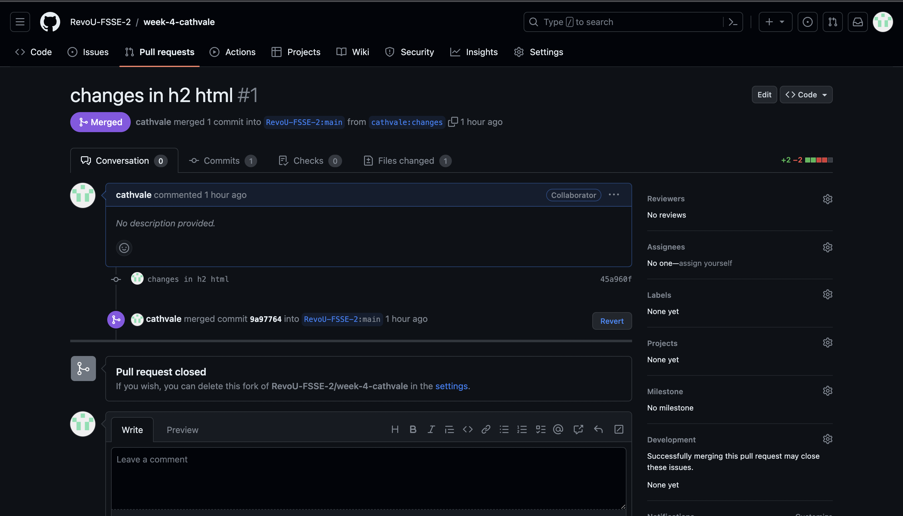

# Deployment Process of Traveplan

Deployment is one of the important process in building a website.
By deploying our website to the production, user can visit our website by typing the name of the website on the internet.

## On this repository, I will tell you the process of Deploying Traveplan Website:
### 1. Buy a Domain

For this website, I'm buying ".site" domain from Niagahoster.

### 2. Connect the Domain with Cloudflare

After buying the domain, I connected the domain with Cloudflare.
On the picture is shown the final result after the domain is successfully connected.

### 3. Connect Netlify and Deploy using GitHub

The third step after the domain is successfully connected is to connect to Netlify and Deploy the website using GitHub.
By choosing "Deploy with GitHub", the deployment are able to proceed automatically once user change the code on GitHub.

### 4. Add Domain on Netlify

Netlify will give you a free domain and random website name once you deploy the website. You are able to change the domain by add domain in "Domain Configuration" section.
On this picture, the domain ".site" are already registered and user are able to visit the website by typing [traveplan.site](https://traveplan.site/) on the internet.

## Pull Request and Merge on GitHub:
On this reposiory, I also learn to use the pull request function and merge on GitHub.
I change the description of the website a little bit and I upload the changes on different branch. Here is the detailed explanation about the process:

### 1. Push the changes to "Changes" branch on GitHub

After making the changes on HTML, I push the changes to "changes" branch on my Repository using Terminal.

### 2. Changes are Reflected on GitHub

After the terminal show success message, the changes are reflected on GitHub and when you go to the "Pull Request" section, GitHub shows you the code changes between "Main" branch and "Changes" branch.
If the changes is correct, you can click "Create Pull Request" button on the top pages.

### 3. Pull Request is Success

Once the Pull Request is success, GitHub will redirect you to the detailed pull request page of the changes and you can click "Merge pull request" button if you want to merge the changes.

### 4. Successfully Merge

After user confirm to merge, GitHub will show merge success message and the changes will be reflected on the website.

## Here is the before and after of the website
### Before Changes

### After Changes

